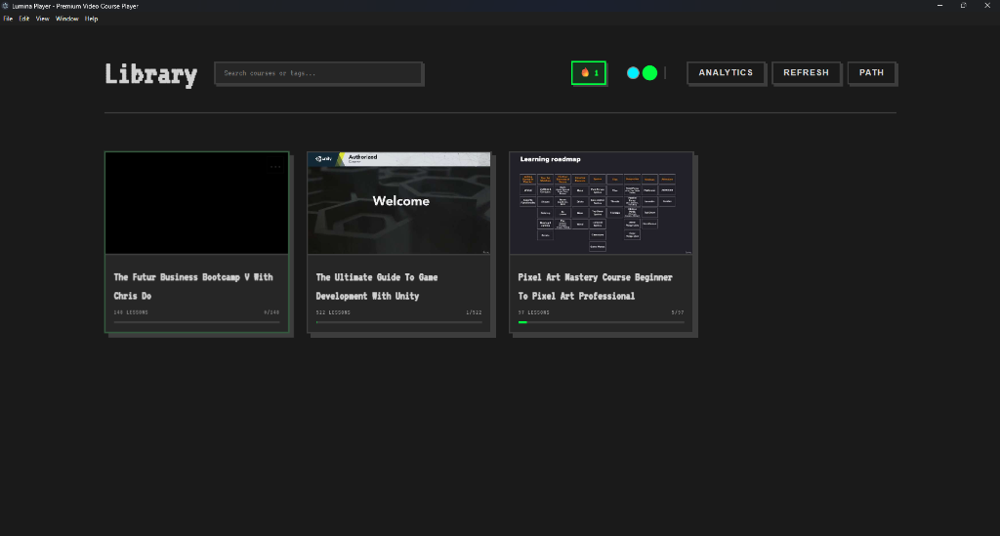
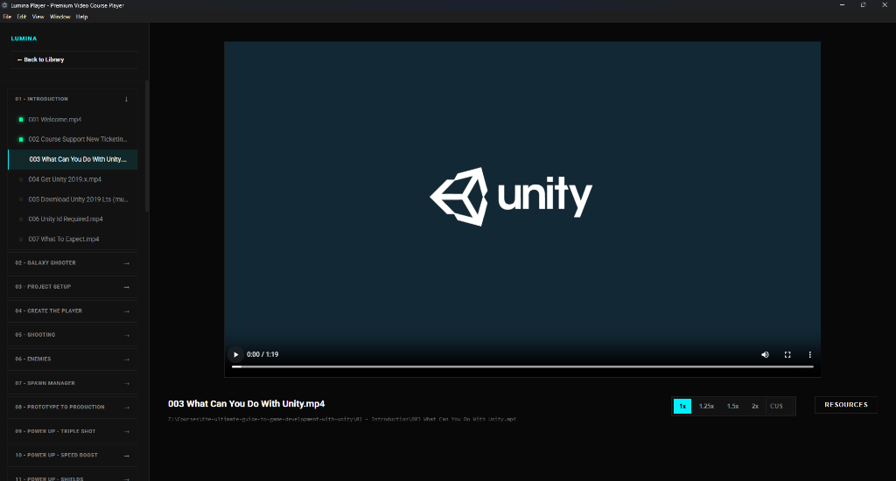
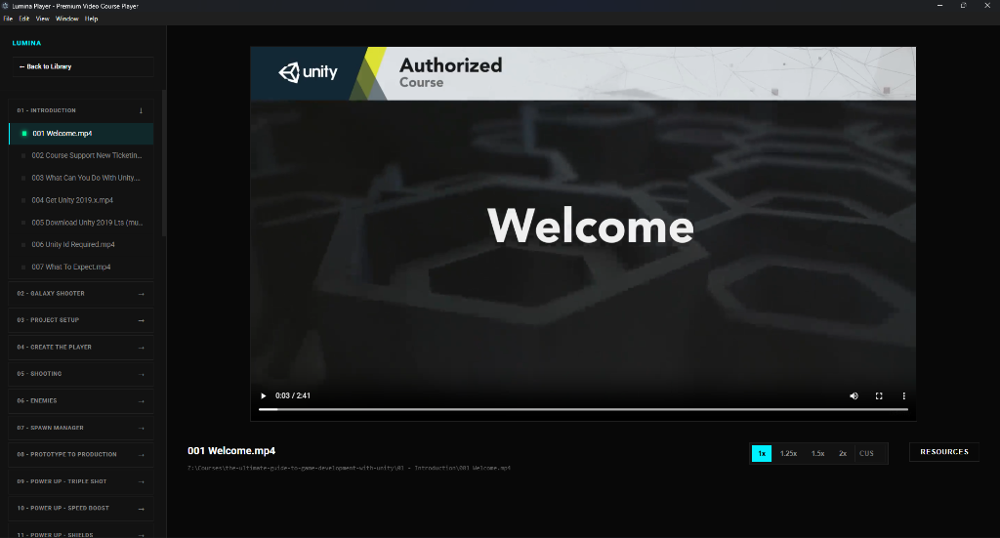

# Lumina Player

Lumina is a desktop offline video player designed for organized locally downloadedd udemy course viewing. It provides a youtube-like environment for playing local udemy videos with automated organization and categorization.

## Features

- **Folder-Based Library**: Automatic organization of course files by selecting a root directory. (Udemy optimized)
- **Categorization**: Support for tagging courses to manage content by subject or priority.
- **Performance**: Built with Vite, Vue 3, and Electron for a responsive desktop interface. (Runs fast on devices with a memory footprint of ~120mb)
- **Aesthetics**: Dark-themed interface utilizing smooth transitions and modern design principles.
- **Development**: Developed with TypeScript for type safety and maintainability.
- **Portability**: Can run on anything that supports electron (Linux, Windows, Mac)

## Screenshots

### Library View


### Video Playback


### Video Explorer


## Getting Started

### Prerequisites

- Node.js (v24 or higher) (recommended)
- npm (11.6.2 or higher) (recommended)

### Installation

1. Clone the repository:
   ```bash
   git clone https://github.com/OwlWorksInnovations/lumina-player.git
   cd lumina-player
   ```

2. Install dependencies:
   ```bash
   npm install
   ```

3. Run development mode:
   ```bash
   npm run dev
   ```

## Building for Production

To generate a standalone executable:

```bash
npm run build
```

## Contributing

Contributions are welcome. Please open an issue or submit a pull request for improvements.

## License

This project is licensed under the MIT License.
